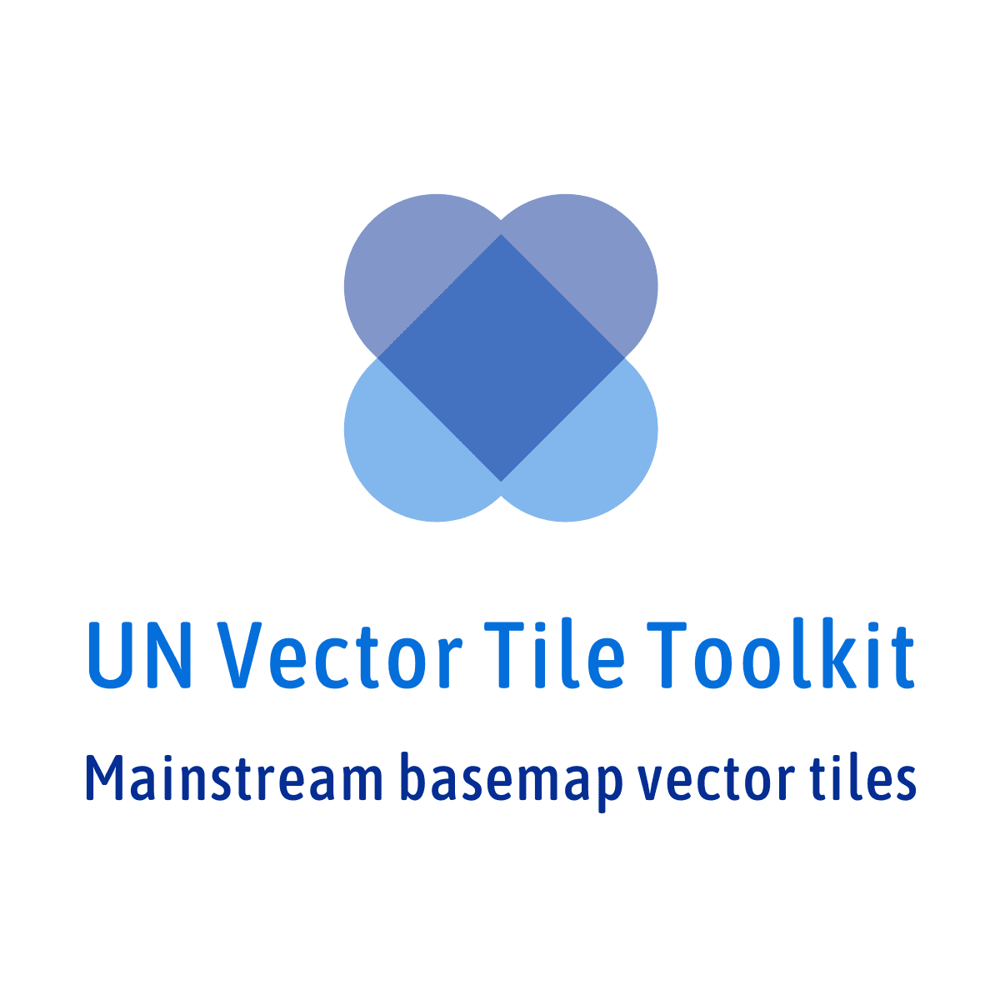

UN Vector Tile Toolkit is to equip diverse basemap providers with Open Source software for vector tiles.

We people are progressively applying web map technologies in professional operations, such as disaster response, situational awareness, sustainable development and statistical analysis.

Among other applications, mobile applications for the use of tablets and smartphones make web map technology virtually essential, because such application needs to work with relatively limited device performance and bandwidth. The virtue of web map technology to work with the limited but connected environment by design benefits professional operations well.

On the other hand, such mobile applications are enablers for the utilization of geospatial technology in the actual field of substantive importance. In this view, web map technologies are of strategic importance.

Professional operations often require adequate basemap which meets the requirements of the respective professional fields. In such cases, such basemaps need to reflect the expertise of individual organizations, rather than just making use of the basemaps from dominant web map platforms.

Such a requirement for a customized basemap of often seen in public organizations. For example, the United Nations (UN) situational awareness platform for the peacekeeping operations requires a custom basemap reflecting knowledge accumulated in the operations.

In this context, the UN Open GIS Initiative initiated a project to support production and consumption of basemaps which endure operational use using the modern web map technology. The project started in 2018 under the name of UN Vector Tile Toolkit.

The UN Open GIS Initiative is a participatory initiative to identify and develop an open source GIS bundle that meets the requirements of UN operations, taking full advantage of the expertise partners. The UN Vector Tile Toolkit is a project under Spiral 4 of the UN Open GIS Initiative, taking full advantage of the expertise originated from free and open source geospatial software communities worldwide and the national geospatial information authority of Japan.

The UN Vector Tile Tooklit is open software intended to support mainstreaming of the vector tile technology in basemap used in public organization. Dominant web map platforms put vector tile technology into service since around 2010. Carefully produced vector tiles can realize fast and beautiful rendering of basemap with small data size footprint. Besides, the clients can adjust the basemap rendering on their request. Open source implementation of the vector tile technology has been there since around 2014. At present, more and more organizations and vendors are adopting this technology.

The UN Vector Tile Toolkit takes full advantage of existing open source software. And it aims to enable sustainable production, consumption, and optimization of basemap vector tiles. Also, the UN Vector Tile Toolkit aims to ensure interoperability of vector tiles so that various software can make use of the vector tiles produced using the toolkit.

The UN Vector Tile Toolkit consists of scripts and documentation for the following six domains:

- [Production](production): Automation and continuous update of vector tiles
- [Statistics](statistics): Indicators for optimizing the size of each vector tile
- [Hosting](hosting): Simple and fast hosting of vector tiles
- [Styling](styling): Browsing and style editing of vector tiles
- [Interoperability](interoperability): Making vector tiles usable from various software
- [Conversion](conversion): converting existing vector tiles into optimized vector tiles

